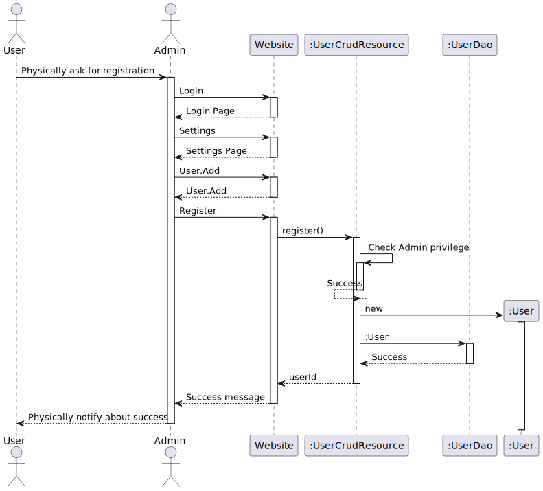
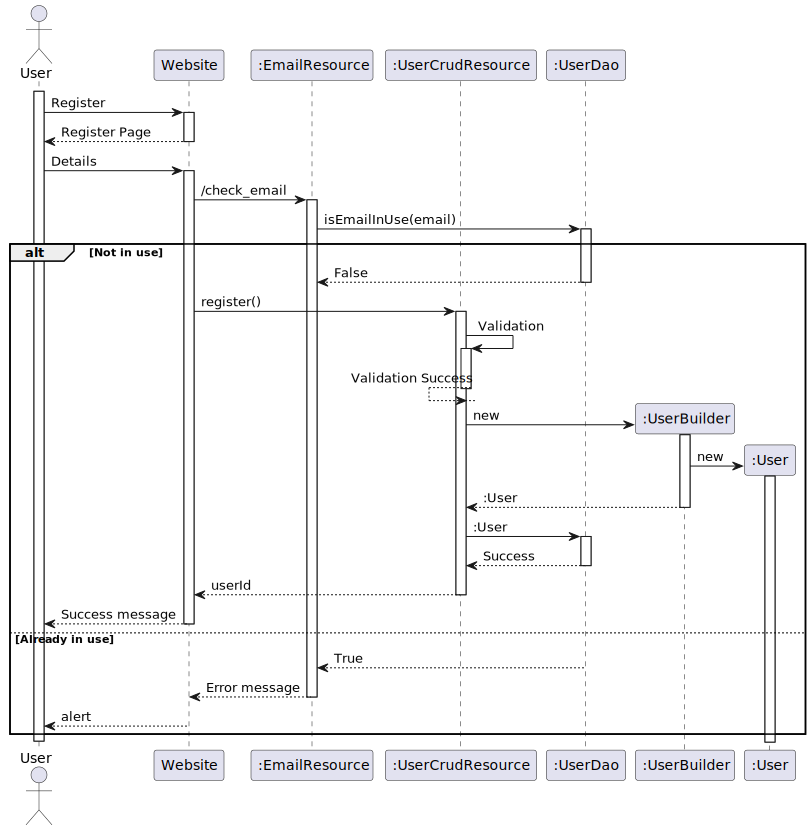

# Part 1: Better user management

## Existing Flow:

This existing flow requires Admin to act as a mediator between User and the system to create a new User account

## New Flow:

New flow completely removes the Admin from the process, there by easing the process for Registration.

## Exact Code changes:

1. Adding new function `Boolean isEmailInUse(email)` to check if an email is already in Use.
2. New class `UserBuilder` which helps creation of `User` easier.
3. new Resource `EmailResource` at endpoint `/check_email`.
4. `EmailResource` contains `checkEmail` function at `POST /check_email` that checks if a Email is already used, using `UserDao.isEmailInUse`
5. `UserCrudResource.register` now uses the `UserBuilder` to create instead of directly creating the `User` and setting attributes. 
6. Frontend changes:
  - new register page
  - button in login page
  - register controller. which on submit, first `check_email` and then `register`

## Design Patterns Used

### Builder Pattern

The change introduced in the provided code involves transitioning from a direct instantiation and manual setting of properties in the `User` class to using a builder pattern implemented in the `UserBuilder` class. 

Advantages of this refactoring is:

#### Improved Readability and Conciseness
With the builder pattern, the code for creating a User object is more concise and readable. Instead of multiple setter calls, you have a chain of method calls on the builder, which clearly indicate the properties being set.

#### Encapsulation
The builder pattern encapsulates the construction process within a separate class (UserBuilder). This separates the construction logic from the User class itself, adhering to the Single Responsibility Principle (SRP). The User class is now only concerned with representing user data, while the construction logic is handled by the builder.

#### Flexibility and Extendibility
The builder pattern allows for easy addition of optional parameters or variations of User objects without cluttering the User class with numerous constructors or setter methods. You can simply add new methods to the UserBuilder class to support additional properties or configurations.

#### Defaults and Consistency
The builder pattern allows for setting default values for properties, as seen in the UserBuilder constructor where default values for roleId, localeId, etc., are provided. This ensures consistency in object creation and reduces the likelihood of errors due to missing or incorrect property initialization.

Overall, the transition to the builder pattern offers several advantages including improved readability, encapsulation, flexibility. It enhances maintainability by separating concerns and facilitating future extensions or modifications to the User class. Additionally, it promotes a more fluent and expressive style of object creation, which can lead to cleaner and more maintainable codebases.

