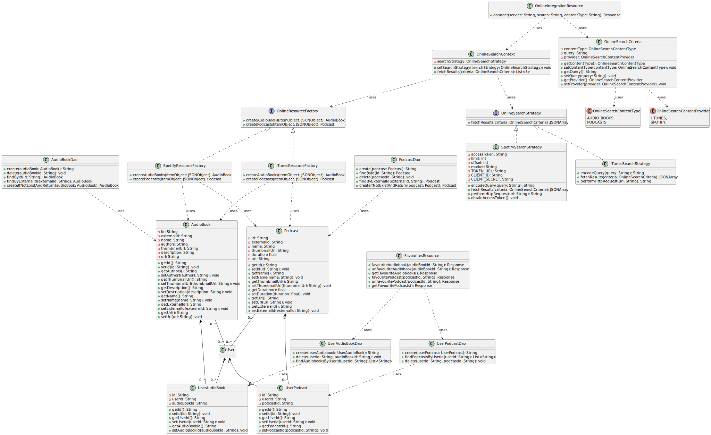
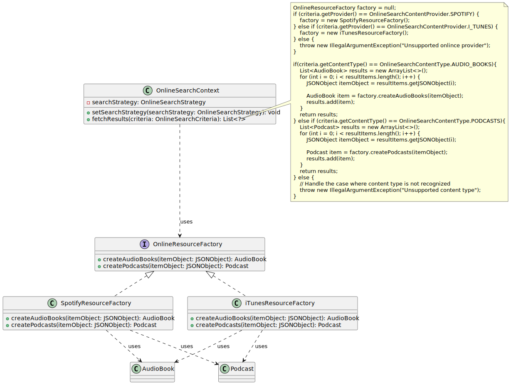
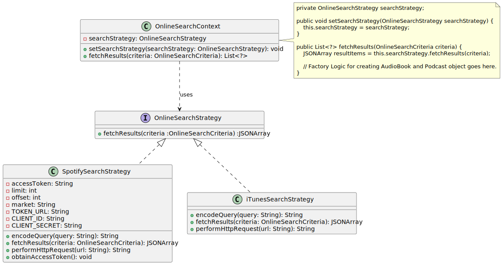

# Part 3: Online Integration

## Class diagram of the new classes for this feature:

## Exact Code changes:

1. added `OnlineSearchContentProvider` enum data type
2. added `OnlineSearchContentType` enum data type
3. `AudioBook` class that contains data related to an audiobook (common to Spotify and ITunes). along with its DAO (having function for creation, deletion, and different types of retrivals). Uniquely Identified by both `id` and `externId` (externId is the Id provided by the Spotify and ITunes APIs, this remains constant accross multiple API hits)
4.  `Podcast` class that contains data related to an podcast (common to Spotify and ITunes). along with its DAO (having function for creation, deletion, and different types of retrivals). Uniquely Identified by both `id` and `externId` (externId is the Id provided by the Spotify and ITunes APIs, this remains constant accross multiple API hits)
5. `UserAudioBook` and `UserPodcast` are classes that hold the relation between `User` (through userId) and `AudioBook`, `Podcast` (through audioBookId and podcast Id respectively). and their corresponding DAO classes.
6. `OnlineSearchCriteria` is a class that holds data of a query done by the user. holds `OnlineSearchContentProvider`, `OnlineSearchContentType` and `query` data.
7. `OnlineResourceFactory` is an interface that is to be used to create `AudioBook` and `Podcast` (using `createAudioBooks` and `createPodcasts` methods) Objects from the `JSONObject` type data provided by the `OnlineSearchStrategy` (i.e from the API). `SpotifyResourceFactory` and `iTunesResourceFactory` are the concrete implementations of this interface.
8. `OnlineSearchStrategy` is an interface that is implemented by `SpotifySearchStrategy` and `iTunesSearchStrategy` to extract `JSONArray` type data from the API endpoints of respective service. Each of it takes input `OnlineSearchCriteria` and uses the `OnlineSearchContentType` and `query` attributes of this class.
9. `OnlineIntegrationResource` acts as an endpoint for the frontend to make a query to the service for the list of AudioBooks and Podcasts. this `OnlineIntegrationResource` class uses `OnlineSearchStrategy` to do the required.
10. `FavouritesResource` class has all endpoints to add/remove AudioBook or Podcast to/from a user's favourite list. 

## Basic Flow of this new feature:
1. User goes to the respective webpage
2. User selects Service Provider (Spotify or iTunes)
3. User selects Content Type (AudioBooks or Podcasts)
4. User enters the search query and clicks 'search'.
5. On searching, all the results are added to database `AudioBook` and `Podcast`
6. Then the data is returned to user and shown in the website. user gets an option to favourite any `AudioBook` or `Podcast`.
7. When user favourites a `AudioBook` or `Podcast`, the corresponding userId and audioBookId, podcastId is added to `UserAudioBook` or `UserPodcast`. 
8. he can view this favourites form "Favourites" tab. where he gets to choose to unfavourite them also. when unfavourite is clicked, the corresponding row from `UserAudioBook` or `UserPodcast` is removed.

## Design Patterns Used

### Factory Pattern

The Factory Pattern is incredibly useful in this context, especially when dealing with object creation and handling different types of resources from various providers like Spotify and iTunes.

Advantages of this pattern in this context include:

#### Encapsulation of Object Creation: 
The Factory Pattern encapsulates the creation logic for objects like `AudioBook` and `Podcast`, allowing you to hide the complex creation process from the client. This promotes a clean separation of concerns and keeps the codebase more maintainable.

#### Abstraction: 
By using the Factory Pattern, you're abstracting the creation of `AudioBook` and `Podcast` objects behind an interface (`OnlineResourceFactory`). This abstraction allows you to change the implementation details of how these objects are created without affecting the client code.

#### Code Extensibility: 
Adding new types of resources or content providers becomes easier with the Factory Pattern. For example, if you need to add support for a new content provider like SoundCloud in the future, you can simply create a new implementation of `OnlineResourceFactory` without modifying existing code.

#### Ease of Testing: 
By using the Factory Pattern, you can easily mock the creation process of `AudioBook` and `Podcast` objects during testing. This facilitates unit testing and ensures that your code behaves as expected under different scenarios.

In summary, the Factory Pattern brings several benefits to your application architecture by providing a flexible and maintainable approach to object creation, especially in the context of handling different types of resources from multiple providers.

### Strategy Pattern

The Strategy Pattern proves invaluable for managing various online search strategies, such as those for Spotify and iTunes. By abstracting the search algorithms into separate implementations of the OnlineSearchStrategy interface, such as SpotifySearchStrategy and iTunesSearchStrategy, the pattern promotes flexibility, extensibility, and maintainability in the application architecture. With the Strategy Pattern, algorithms can be dynamically selected at runtime, facilitating dynamic behavior, separation of concerns, and easy testing of individual strategies.

Few of the Advantages in this context include:

#### Encapsulation of Algorithms: 
The Strategy Pattern encapsulates algorithms (represented by the `OnlineSearchStrategy` interface and its implementations) independently of the client that uses them. This allows for easy swapping of algorithms at runtime without affecting the client's code.

#### Flexibility and Extensibility: 
By employing the Strategy Pattern, you can introduce new search strategies (e.g., for different providers or content types) by simply implementing the `OnlineSearchStrategy` interface. This promotes code extensibility and accommodates future changes without the need for significant modifications to existing code.

#### Dynamic Behavior: 
Since the Strategy Pattern enables the selection of algorithms at runtime, it facilitates dynamic behavior in your application. This is particularly useful when dealing with user preferences, changing requirements, or different environmental conditions.

#### Separation of Concerns: 
The Strategy Pattern separates the concerns related to search algorithms from the classes that use them (e.g., OnlineResourceFactory). This separation promotes a cleaner codebase, improves maintainability, and makes it easier to understand and modify the behavior of each component independently.

#### Testability: 
By using the Strategy Pattern, you can easily test each search strategy in isolation, independently of the client code. This promotes unit testing and ensures that each strategy behaves as expected under different scenarios.

