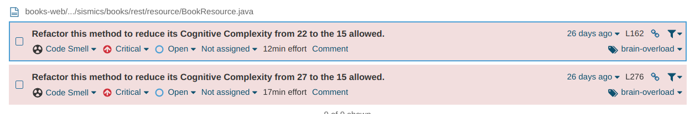

## 1. Lazy Class & Deficient Encapsulation: Constants (com.sismics.books.core.constant)

### Overview

The Constants class provides a set of static final fields representing various default values and identifiers used throughout the application, such as default locale, timezone, theme, administrator's default password, and default user role.

### Analysis

1. `Limited Functionality`: The Constants class primarily consists of static final fields with default values and identifiers. It does not contain any methods or behavior beyond initializing these constant values.
2. `Minimal Complexity`: Due to its simplistic nature, the Constants class has minimal complexity. It merely serves as a repository for storing constant values, which are accessed throughout the application.
3. `Lack of Responsiveness`: While the class encapsulates related constants, it does not actively contribute to the behavior or functionality of the application. It remains inert and does not participate in any computational tasks.

### Recommendations

1. `Eliminate Unnecessary Abstraction`: Since the constant values are only used sporadically or by a limited number of classes, inline them directly where needed to reduce the overhead of maintaining a separate class.

### Conclusion

The Constants class exhibits the "Lazy Class" design smell due to its limited functionality and lack of responsiveness. While it serves the purpose of centralizing constant values, its existence may not be justified if it merely holds values that are rarely accessed or updated. Evaluating the necessity of the Constants class and potentially integrating its constants directly into relevant classes can streamline the codebase and enhance maintainability.

<div style="page-break-before: always;"></div>

## 2. God Class: UserResource (books-web com.sismics.books.rest.resource)

### Overview

The UserResource class serves as a RESTful resource for handling various user-related operations, including user registration, updating user information, user authentication, session management, user deletion, and user information retrieval.

```
class UserResource extends BaseResource {
    + login(username :String, password :String, remember :boolean) :void
    + logout() :void
    + info() :void
    + update(password :String, email :String, theme :String, locale :String, first_connection :Boolean) :void
    + update(username :String, password :String, email :String, theme :String, locale :String) :void
    + session() :void
    + deleteSession() :void
    + list(limit :Integer, offset :Integer, sort_column :Integer, asc :Boolean)
    + view(username :String) :void
    + delete() :void
    + delete(username :String) :void
    + register(username :String, password :String, email :String, localeId :String) :void
    + checkUsername(username :String) :Boolean
}
```

### Analysis

1. `Multipurpose Resource Class`: The UserResource class combines multiple functionalities related to user management within a single class. It handles user registration (PUT method), updating user information (POST methods), user authentication (POST method), user session management (GET and DELETE methods), user deletion (DELETE methods), and user information retrieval (GET methods).
2. `Violation of Single Responsibility Principle (SRP)`: The class violates the SRP by encompassing too many responsibilities. Each method within the class deals with different aspects of user management, leading to a lack of cohesion and increased complexity.
3. `Complexity and Coupling`: Including diverse functionalities within the same class increases complexity and tight coupling between different parts of the code. This makes it difficult to modify or extend the functionality without affecting other parts of the system.

### Recommendations

1. `Refactor into Coherent Components`: Separate the functionalities of the UserResource class into smaller, more cohesive components, each responsible for a specific aspect of user management. For example, create separate resource classes for user registration, user authentication, session management, etc.
2. `Use Composition over Inheritance`: Instead of handling all functionalities within the UserResource class hierarchy, use composition to encapsulate behavior in separate classes that can be easily composed together.
3. `Adhere to RESTful Principles`: Follow RESTful design principles, such as organizing resources around entities and using HTTP methods to represent CRUD operations. Each resource class should focus on a specific entity or a closely related set of functionalities.

### Conclusion

The "`God Class`" design smell in the UserResource class indicates a need for refactoring to improve maintainability, modularity, and adherence to design principles. By restructuring the code into smaller, focused components and adhering to RESTful principles, the codebase can become more manageable and easier to maintain.

<div style="page-break-before: always;"></div>

## 3. God Class: BookResource (books-web com.sismics.books.rest.resource)

### Overview

The `BookResource` class acts as a RESTful endpoint for managing a broad spectrum of book-related operations within the application.

### Code Snippet

```java
class BookResource extends BaseResource {
    +add(String): Response
    +delete(String): Response
    +addManually(): Response
    +update(): Response
    +get(): Response
    +cover(): Response
    +updateCover(): Response
    +list(): Response
    +importFile(): Response
    +read(): Response
}
```

### SonarQube identified Code smell



### Analysis

1. `Multipurpose Resource Class`: BookResource consolidates a variety of functionalities related to book management, from CRUD operations to handling book covers and book imports, within a single class.
2. `Violation of Single Responsibility Principle (SRP)`: By managing multiple responsibilities, the class violates the SRP, leading to a lack of cohesion and unnecessary complexity.
3. `Complexity and Tight Coupling`: The class's broad scope increases complexity and tight coupling, making modifications or extensions potentially risky and difficult to manage.

### Recommendations

1. `Refactor into Coherent Components`: Breaking down BookResource into smaller, more focused classes can improve system maintainability and clarity. For instance, separate classes for handling book CRUD, book covers, and book imports could be more effective.
2. `Use Composition over Inheritance`: Employing composition to encapsulate specific behaviors in separate classes allows for more flexible and modular design.
3. `Adhere to RESTful Principles`: Ensuring that the resource classes strictly follow RESTful principles can help organize the system around entities and their operations, leading to a more intuitive and maintainable codebase.

### Conclusion

Addressing the "`God Class`" design smell in BookResource is crucial for enhancing the system's maintainability, scalability, and overall architecture. Through thoughtful refactoring and adherence to design principles, the application can achieve a more modular and robust structure.

<div style="page-break-before: always;"></div>


## 4. Speculative Generatility: App.java (books-core com.sismics.books.core.model.jpa)

### Overview

The provided code exhibits a design smell known as "Speculative Generaility." It involves the `App` class and 8 other classes linked to the `App` class. Originally, the App class was made to let users sign in with many different services, but it's actually being used only for Facebook. Since the other parts aren't being used, it's suggested to get rid of the App class to make the code simpler.

```java
@Entity
@Table(name = "T_APP")
public class App {
    /**
     * Connected application ID.
     */
    @Id
    @Column(name = "APP_ID_C", length = 20)
    private String id;

    /**
     * Getter of id.
     *
     * @return id
     */
    public String getId() {
        return id;
    }

    /**
     * Setter of id.
     *
     * @param id id
     */
    public void setId(String id) {
        this.id = id;
    }
}
```

### Analysis

### Issues:

1. **Unnecessary Complexity** : The `App` class, designed to support multiple third-party sign-ins, introduces unnecessary complexity since only Facebook OAuth is utilized. This results in dead code that complicates maintenance and understanding of the authentication mechanism.
2. **Redundant Code and Over-Engineering** : The inclusion of the `App` class and its associated attributes across various classes adds redundancy and over-engineering to the system. This violates the principle of keeping the codebase lean and focused on current requirements, leading to wasted resources on maintaining unused parts of the code.

### Recommendations

To address these issues:

* Locate and update all classes linked to App.java, removing the appId parameter from their functions to simplify user and app filtering.
* Eliminate the AppId.java file and remove the reference to the App class in persistence.xml to clean up the system's tracking of classes.

### Conclusion

This refactoring simplifies the codebase by removing unused complexities like the App class and related attributes meant for multiple third-party sign-ins. It improves maintainability, making the code easier to navigate and update. By focusing on the application's actual needs currently, only Facebook OAuth, this change enhances the overall efficiency and adaptability of the codebase.

<div style="page-break-before: always;"></div>

# 5. Feature Envy Smell : TagDao.java  (books-core com.sismics.books.core.dao.jpa)

## Overview

The `TagDao.java` class in the `com.sismics.books.core.dao.jpa` package is responsible for data access operations related to `Tag` entities in a Java application. This class exhibits a potential design smell known as "Feature Envy," where methods show more interest in the data and methods of another class or entity than in their own. Upon review and refactoring, efforts were made to address this design smell, enhancing the class's design and maintainability.

## Code Snippet

```java
public List<Tag> getByUserId(String userId) {
    EntityManager em = ThreadLocalContext.get().getEntityManager();
    Query q = em.createQuery("select t from Tag t where t.userId = :userId and t.deleteDate is null order by t.name");
    q.setParameter("userId", userId);
    return q.getResultList();
}

```

## Analysis

The original `TagDao.java` class demonstrated characteristics that could be interpreted as Feature Envy towards the `EntityManager` and the `Tag` entities, primarily due to its methods extensively manipulating these objects' states and data. Key observations include:

1. **Direct and Repetitive Interactions with EntityManager**: Many methods directly interact with `EntityManager` for performing CRUD operations, suggesting a strong dependency and "envy" towards the capabilities provided by `EntityManager`.
2. **Repetitive Data Manipulation Logic**: The class contains multiple instances of similar data manipulation logic for different operations, indicating a possible over-reliance on the functionalities of the `Tag` entity and `EntityManager`.
3. **Lack of Encapsulation**: The direct use of `EntityManager` and detailed query construction within public methods could be seen as a lack of encapsulation, with the `TagDao` class showing more interest in the specifics of data access and manipulation than in abstracting these details away.

## Refactoring to Address Feature Envy

The refactoring effort aimed to mitigate the identified Feature Envy by restructuring the class to better encapsulate data access logic and reduce the direct dependency on `EntityManager` and `Tag` entity details. Key refactoring steps included:

1. **Centralizing EntityManager Access**: By initializing `EntityManager` once in the constructor and reusing it across methods, the refactored code reduces direct access to `EntityManager`, thereby addressing the class's "envy" towards it.
2. **Extracting Data Manipulation into Private Methods**: Repetitive data manipulation logic was extracted into private helper methods, reducing the public methods' dependency on the intricacies of `EntityManager` and `Tag` entity operations.
3. **Improving Encapsulation and Cohesion**: The refactoring introduces a clearer separation of concerns, with private methods handling specific aspects of data manipulation. This approach improves encapsulation and reduces the class's overall "envy" towards external functionalities.

## Conclusion

The refactoring of `TagDao.java` to address Feature Envy involved restructuring the class to improve encapsulation, reduce direct and repetitive interactions with `EntityManager`, and better organize data manipulation logic. These changes enhance the class's maintainability, reduce complexity, and align its design more closely with object-oriented principles, thereby addressing the identified design smell effectively.

<div style="page-break-before: always;"></div>

# 6. God Class Design Smell : AppContext.java (books-core com.sismics.books.core.model.context)

## Overview

The `AppContext.java` class in the `com.sismics.books.core.model.context` package serves as a central configuration point for managing services, event buses, and executors in a Java application. Initially, this class exhibited characteristics of a God Class design smell, where a single class holds too many responsibilities, directly manages numerous low-level details, and interacts extensively with various components of the application. The class was identified for refactoring to enhance its maintainability, scalability, and adherence to object-oriented design principles.

## Code Snippet

```

public class AppContext {
    private static AppContext instance;
    private EventBus eventBus;
    private EventBus asyncEventBus;
    private EventBus importEventBus;
    private BookDataService bookDataService;
    private FacebookService facebookService;
    private List<ExecutorService> asyncExecutorList;

    private AppContext() {
        eventBus = new EventBus();
        asyncExecutorList = new ArrayList<>();
        
        // Creating and registering event listeners directly
        eventBus.register(new DeadEventListener());
        
        asyncEventBus = new AsyncEventBus(Executors.newCachedThreadPool());
        asyncEventBus.register(new UserAppCreatedAsyncListener());
        
        importEventBus = new AsyncEventBus(Executors.newCachedThreadPool());
        importEventBus.register(new BookImportAsyncListener());
        
        // Directly managing service initialization
        bookDataService = new BookDataService();
        bookDataService.startAndWait();
        
        facebookService = new FacebookService();
        facebookService.startAndWait();
    }

    // Singleton access method and getters for various components
    ...
}
```

## Analysis

The original `AppContext.java` class demonstrated several issues indicative of the God Class design smell:

1. **Multiple Responsibilities**: `AppContext` was responsible for initializing and managing services (e.g., `BookDataService`, `FacebookService`), configuring event buses (synchronous and asynchronous), and managing executors for asynchronous tasks. This aggregation of responsibilities made the class complex and hard to maintain.

2. **Direct Management of Low-Level Operations**: The class directly created and managed `ExecutorService` instances, configured `EventBus` objects, and initialized service objects, showing a deep involvement in low-level operational details rather than delegating these responsibilities.

3. **Poor Encapsulation and Cohesion**: The presence of multiple functionalities within `AppContext` led to poor encapsulation, where details of service management and event bus configuration were exposed. This also affected the class's cohesion, as it was involved in unrelated tasks.

## Refactoring to Address God Class

The refactoring effort focused on decomposing `AppContext` into more focused, cohesive classes that each handle a specific aspect of the application's configuration and management. Key refactoring steps included:

1. **Extracting Service Management**: A new `ServiceManager` class was introduced to encapsulate the initialization and lifecycle management of services like `BookDataService` and `FacebookService`, separating these concerns from the main application context.

2. **Decoupling EventBus Management**: An `EventBusManager` class was created to manage the creation, configuration, and lifecycle of different `EventBus` instances and their associated executors, improving the modularity of event handling.

3. **Maintaining Singleton Pattern for Central Access**: While decomposing responsibilities, the singleton pattern for `AppContext` was preserved, ensuring that it remained the central access point for other parts of the application to retrieve services and event buses, thereby maintaining ease of use and access control.

## Conclusion

The refactoring of `AppContext.java` to mitigate the God Class design smell involved breaking down the class into smaller, more focused classes (`ServiceManager` and `EventBusManager`), each dedicated to a specific aspect of application management. This approach significantly improved the maintainability and scalability of the code, enhanced encapsulation and cohesion, and aligned the application's architecture more closely with the principles of object-oriented design. The changes facilitated easier updates, testing, and extension of the application's components, effectively addressing the identified design smell.

# 7. Missing Abstraction: UserBookDao.java (books-core com.sismics.books.core.dao.jpa)

## Overview

The `UserBookDao` class in the provided code demonstrates a design smell identified as "Missing Abstraction." This issue is evident in the method `findByCriteria`, which directly constructs and executes SQL queries without leveraging an intermediate abstraction layer. The class directly manipulates strings for query construction and parameter handling, leading to a lack of clear encapsulation and reuse of query logic.


## Code Snippet

```java
/**
 * User book DAO.
 */
public class UserBookDao {

    /**
     * Creates a new user book.
     * 
     * @param userBook UserBook
     * @return New ID
     */
    public String create(UserBook userBook) {
        // Implementation hidden
    }

    /**
     * Deletes a user book.
     * 
     * @param id User book ID
     */
    public void delete(String id) {
        // Implementation hidden
    }

    /**
     * Return a user book.
     * 
     * @param userBookId User book ID
     * @param userId User ID
     * @return User book
     */
    public UserBook getUserBook(String userBookId, String userId) {
        // Implementation hidden
    }

    /**
     * Return a user book by ID.
     * 
     * @param userBookId User book ID
     * @return User book
     */
    public UserBook getUserBook(String userBookId) {
        // Implementation hidden
    }

    /**
     * Return a user book by book ID and user ID.
     * 
     * @param bookId Book ID
     * @param userId User ID
     * @return User book
     */
    public UserBook getByBook(String bookId, String userId) {
        // Implementation hidden
    }

    /**
     * Searches user books by criteria.
     * 
     * @param paginatedList List of user books (updated by side effects)
     * @param criteria Search criteria
     * @param sortCriteria Sort criteria
     */
    public void findByCriteria(PaginatedList<UserBookDto> paginatedList, UserBookCriteria criteria, SortCriteria sortCriteria) {
        // Implementation hidden
    }
}
```

## Issues:

1. **Direct SQL Query Manipulation** : The method `findByCriteria` constructs SQL queries through string concatenation based on various criteria. This approach mixes the logic of query construction with the business logic of fetching user books, complicating the method's readability and maintainability.
2. **Primitive Parameter Handling** : Parameters for the SQL queries are managed using a `Map<String, Object>`, which is a low-level mechanism. This practice does not encapsulate parameter handling, making the code more error-prone and less expressive.
3. **Lack of Reusability and Extensibility** : Because the query construction and execution logic is embedded directly within the `findByCriteria` method without a clear abstraction, it becomes challenging to reuse or extend this logic for other similar operations within the application.

## Recommendations

To mitigate these issues:

* **Introduce a Query Builder Abstraction** : Implement a query builder pattern that encapsulates the construction of SQL queries. This abstraction should provide methods for adding conditions, setting parameters, and generating the final query string in a more structured and reusable manner.
* **Parameter Object Pattern** : Adopt a parameter object pattern for managing query parameters, replacing the `Map<String, Object>` with a class that offers type-safe methods for adding and retrieving query parameters. This enhances code clarity and reduces the risk of errors.
* **Criteria to Query Translation** : Develop a separate abstraction that takes search criteria (e.g., `UserBookCriteria`) and translates them into a structured query using the query builder. This separates the concerns of criteria handling from the actual query construction.

## Conclusion

Refactoring the `UserBookDao` class to address the "Missing Abstraction" design smell involves introducing more sophisticated abstractions for SQL query construction and parameter management. By doing so, the codebase benefits from improved readability, maintainability, and extensibility. This adjustment allows for a clearer separation of concerns, making the system more adaptable to changes and easier to understand for developers.
