

# Task 2b

# Tools Used:

For this code metrics analysis, `CodeMR` was utilized as the primary tool. CodeMR offers a range of metrics that are crucial for understanding the structural complexity and quality of a Java codebase. It provides a reliable and accurate representation of the project's codebase, allowing for a comprehensive analysis of various aspects of the code.

# Code Metrics Analysis:

## Legend for the Below graphs:
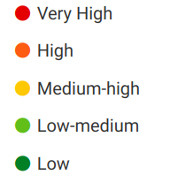

## 1. Cyclomatic Complexity

| 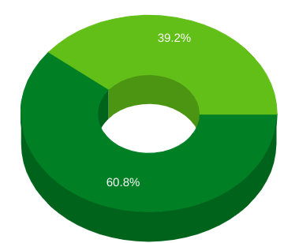 | 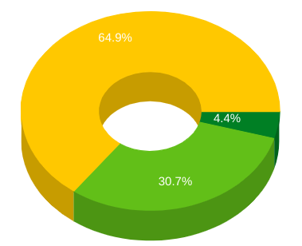 |
|------------|-----------|
| Books Core | Books Web |

### ***Implications for Software Quality, Maintainability, and Performance***

Implies being difficult to understand and describes the interactions between a number of entities. Higher levels of complexity in software increase the risk of unintentionally interfering with interactions and so increases the chance of introducing defects when making changes.

Cyclomatic Complexity is a software metric used to measure the complexity of a program by counting the number of linearly independent paths through the program's source code. It can have significant implications for software quality, maintainability, and potential performance issues.

#### Software Quality:
- Higher cyclomatic complexity often indicates higher risk and lower software quality. Code with high cyclomatic complexity tends to be more difficult to understand, test, and maintain. It increases the likelihood of errors and bugs, leading to decreased software reliability.
- By managing cyclomatic complexity, developers can improve software quality by writing more understandable, maintainable, and reliable code. Lowering complexity can result in cleaner, more modular code that is easier to comprehend and modify.

#### Maintainability:
- Cyclomatic complexity has a direct impact on maintainability. High complexity makes it harder for developers to understand the codebase, leading to longer maintenance cycles and increased costs.
- By reducing cyclomatic complexity, developers can enhance maintainability by making the codebase more modular and easier to update or extend. Lower complexity enables developers to quickly grasp the logic of the code, identify and fix bugs, and add new features with less effort.

#### Performance Issues:
- While cyclomatic complexity itself doesn't directly affect runtime performance, highly complex code may indirectly lead to performance issues. Complex algorithms or control flows can result in inefficient code that consumes more computational resources or executes slower.
- Additionally, high complexity can make it challenging to optimize code for performance. Developers may struggle to identify performance bottlenecks or implement optimizations in overly complex codebases.

#### Implications for Project's Current State:
- **High Cyclomatic Complexity**: If a project has high cyclomatic complexity, it suggests that the codebase may be difficult to maintain and prone to errors. Developers might spend more time debugging and fixing issues rather than adding new features.
- **Moderate Cyclomatic Complexity**: A moderate level of cyclomatic complexity is generally acceptable, but it still requires attention. It indicates that the codebase could benefit from refactoring or restructuring to improve maintainability and reduce the risk of future issues.
- **Low Cyclomatic Complexity**: A low cyclomatic complexity suggests that the codebase is likely to be more maintainable and have fewer potential issues. However, it's essential to ensure that reducing complexity doesn't sacrifice readability or other aspects of code quality.

## 2. Coupling

| 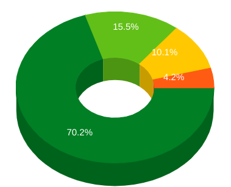 | 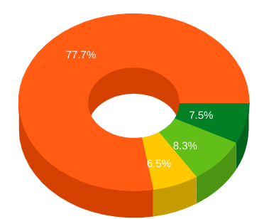 |
|------------|-----------|
| Books Core | Books Web |

### ***Implications for Software Quality, Maintainability, and Performance***

Coupling between two classes A and B if:

* A has an attribute that refers to (is of type) B.
* A calls on services of an object B.
* A has a method that references B (via return type or parameter).
* A has a local variable which type is class B.
* A is a subclass of (or implements) class B.

Tightly coupled systems tend to exhibit the following characteristics:

* A change in a class usually forces a ripple effect of changes in other classes.
* Require more effort and/or time due to the increased dependency.
* Might be harder to reuse a class because dependent classes must be included.

Coupling refers to the degree of interdependence between software modules or components. It measures how closely connected various parts of a system are. Coupling can have significant implications for software quality, maintainability, and potential performance issues.

#### Software Quality:
- Tight coupling, where modules are highly dependent on each other, can decrease software quality. It makes the system more fragile and harder to modify, as changes in one module can cause ripple effects throughout the codebase.
- Loose coupling, on the other hand, promotes better software quality by reducing dependencies between modules. It enhances code reusability, testability, and scalability, as modules can be modified or replaced without affecting other parts of the system.

#### Maintainability:
- High coupling often leads to decreased maintainability. When modules are tightly coupled, making changes to one module can require modifications in many other modules. This increases the risk of introducing bugs and makes it harder for developers to understand and maintain the codebase.
- Lowering coupling improves maintainability by isolating changes to specific modules. Developers can more easily comprehend and modify individual modules without impacting the rest of the system.

#### Performance Issues:
- Coupling can indirectly impact performance by affecting system complexity and scalability. Highly coupled systems may experience performance bottlenecks due to the tight dependencies between modules.
- In contrast, loosely coupled systems tend to be more scalable and performant. They allow for better optimization and distribution of resources, as changes in one module have minimal impact on others.

#### Implications for Project's Current State:
- **High Coupling**: If a project exhibits high coupling, it suggests that the codebase may be less maintainable and more prone to performance issues. Developers may find it challenging to make changes or optimize the system without causing unintended consequences.
- **Moderate Coupling**: Moderate levels of coupling are common in many software projects. However, it's essential to monitor and manage coupling to prevent it from escalating and negatively impacting software quality and maintainability.
- **Low Coupling**: Low coupling reflects a well-structured and maintainable codebase. It indicates that modules are loosely connected, making the system easier to maintain and scale. However, it's crucial to ensure that low coupling doesn't lead to excessive complexity or decrease in system performance.

## 3. Lines of Code per Class (CLOC)

| 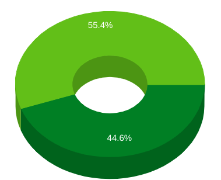 | 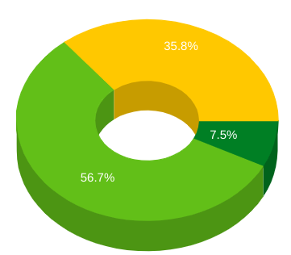 |
|------------|-----------|
| Books Core | Books Web |

### ***Implications for Software Quality, Maintainability, and Performance***

Related Quality Attributes: Size

The number of all nonempty, non-commented lines of the body of the class. CLOC is a measure of size and also indirectly related to the class complexity.

Lines of Code per class is a metric used to measure the size or complexity of individual classes in a software project by counting the number of lines of code within each class. It has implications for software quality, maintainability, and potential performance issues.

#### Software Quality:
- High lines of code per class can indicate overly complex or monolithic classes, which can decrease software quality. Large classes are often harder to understand, test, and maintain, increasing the likelihood of errors and reducing overall code readability.
- Breaking down large classes into smaller, more focused classes can improve software quality by making the codebase more modular and easier to comprehend. Smaller classes are typically easier to understand, test, and maintain, leading to higher software quality.

#### Maintainability:
- Lines of code per class directly impact maintainability. Large classes with excessive lines of code are more challenging to maintain and modify, as changes may have widespread effects throughout the class and the entire codebase.
- By reducing the number of lines of code per class and breaking down large classes into smaller ones, developers can enhance maintainability. Smaller classes are easier to understand, modify, and extend, leading to shorter maintenance cycles and lower maintenance costs.

#### Potential Performance Issues:
- While lines of code per class itself does not directly impact performance, overly complex or monolithic classes may indirectly lead to performance issues. Large classes may contain inefficient algorithms or unnecessary computations, resulting in degraded performance.
- Breaking down large classes into smaller, more focused ones can improve performance by enabling developers to optimize individual classes for better efficiency. Optimized classes lead to better overall performance of the software system.

#### Implications for Project's Current State:
- **High Lines of Code per Class**: Projects with high lines of code per class may suffer from decreased software quality and maintainability. Large classes are harder to understand, modify, and maintain, leading to higher risks of errors and longer maintenance cycles.
- **Moderate Lines of Code per Class**: Moderate levels of lines of code per class are common in many software projects. However, it's essential to monitor and manage this metric to prevent classes from becoming overly complex and difficult to maintain.
- **Low Lines of Code per Class**: Projects with low lines of code per class typically have smaller, more focused classes that are easier to understand, modify, and maintain. Lower lines of code per class contribute to higher software quality, improved maintainability, and better overall performance.

## 4. Lack of Cohesion(LOC)

| 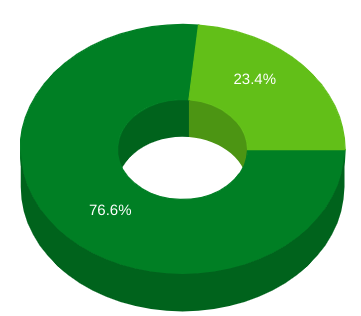 | 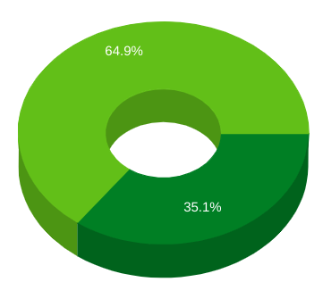 |
|------------|-----------|
| Books Core | Books Web |

### ***Implications for Software Quality, Maintainability, and Performance***

Measure how well the methods of a class are related to each other. High cohesion (low lack of cohesion) tend to be preferable, because high cohesion is associated with several desirable traits of software including robustness, reliability, reusability, and understandability. In contrast, low cohesion is associated with undesirable traits such as being difficult to maintain, test, reuse, or even understand.

Lack of Cohesion (LoC) is a software metric used to assess the degree of relatedness or coherence among elements within a module or class. It measures how well the responsibilities of a module or class are grouped together. Lack of Cohesion can have significant implications for software quality, maintainability, and potential performance issues.

#### Software Quality:
- High Lack of Cohesion within a module or class often indicates poor design and can lead to lower software quality. When responsibilities are scattered or unrelated within a module, it becomes harder to understand, test, and maintain the codebase. This increases the likelihood of errors and reduces overall code readability.
- Improving cohesion by ensuring that related responsibilities are grouped together within modules can enhance software quality. Cohesive modules are easier to understand and maintain, leading to higher code reliability and readability.

#### Maintainability:
- Lack of Cohesion directly impacts maintainability. Modules or classes with low cohesion are harder to maintain, as changes to one responsibility may require modifications in other unrelated parts of the module.
- By increasing cohesion and ensuring that related responsibilities are grouped together, developers can improve maintainability. Cohesive modules reduce the risk of unintended consequences when making changes and simplify the maintenance process.

#### Potential Performance Issues:
- While Lack of Cohesion itself does not directly impact performance, it can indirectly lead to performance issues. Modules or classes with low cohesion may contain inefficient or redundant code, which can degrade system performance.
- Improving cohesion by eliminating redundant code and ensuring that responsibilities are appropriately grouped together can lead to more efficient code and better overall performance.

#### Implications for Project's Current State:
- **High Lack of Cohesion**: Projects with high Lack of Cohesion may suffer from decreased software quality and maintainability. Modules or classes with scattered responsibilities are harder to understand, modify, and maintain, leading to higher risks of errors and longer maintenance cycles.
- **Moderate Lack of Cohesion**: Moderate levels of Lack of Cohesion are common in many software projects. However, it's essential to monitor and manage this metric to prevent cohesion from decreasing further and negatively impacting software quality and maintainability.
- **Low Lack of Cohesion**: Projects with low Lack of Cohesion typically have well-organized and cohesive modules or classes. Responsibilities are clearly grouped together, making the codebase easier to understand, modify, and maintain. Lower Lack of Cohesion contributes to higher software quality, improved maintainability, and better overall performance.

## 5. C3 (ConCeptual Complexity)

| 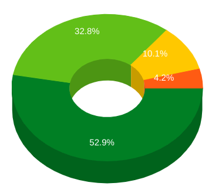 | 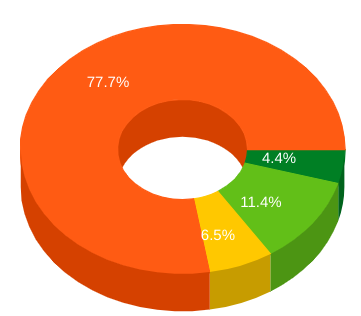 |
|------------|-----------|
| Books Core | Books Web |

### ***Implications for Software Quality, Maintainability, and Performance***

Related Quality Attributes: Coupling, Cohesion, Complexity
The max value of Coupling, Cohesion, Complexity metrics

C3 (Conceptual Complexity) is a metric used to evaluate the complexity of software based on the number of unique paths through the control flow graph. It measures the number of distinct, independent paths through the codebase, providing insights into the complexity of the software's logic. C3 has implications for software quality, maintainability, and potential performance issues.

#### Software Quality:
- High C3 complexity often indicates a high degree of logical intricacy in the code, which can lead to lower software quality. Complex logic increases the likelihood of bugs, errors, and unintended behaviors, making the codebase more error-prone and challenging to maintain.
- Lowering C3 complexity can improve software quality by simplifying the logic, making the codebase easier to understand, test, and debug. Clearer logic enhances code readability, reduces the risk of errors, and improves overall software reliability.

#### Maintainability:
- C3 complexity directly impacts maintainability. Highly complex code with numerous unique paths through the control flow graph is difficult to maintain, as developers must navigate intricate logic to make modifications or enhancements.
- By reducing C3 complexity, developers can enhance maintainability by simplifying the codebase's logic. Simplified logic makes it easier for developers to comprehend, modify, and extend the codebase, leading to shorter maintenance cycles and lower maintenance costs.

#### Performance Issues:
- C3 complexity can indirectly affect performance by introducing inefficiencies in the code. Complex logic may result in inefficient algorithms or resource-intensive computations, leading to degraded performance.
- Simplifying the logic by reducing C3 complexity can improve performance by streamlining algorithms and reducing computational overhead. Optimized logic enhances code efficiency, leading to better overall performance.

#### Implications for Project's Current State:
- **High C3 Complexity**: Projects with high C3 complexity may struggle with software quality and maintainability issues. Complex logic increases the risk of bugs and makes the codebase harder to maintain and extend.
- **Moderate C3 Complexity**: Moderate levels of C3 complexity are common in many software projects. However, it's essential to monitor and manage C3 complexity to prevent it from escalating and negatively impacting software quality and maintainability.
- **Low C3 Complexity**: Low C3 complexity reflects a well-structured and maintainable codebase with simplified logic. Projects with low C3 complexity are easier to understand, modify, and maintain, leading to higher software quality and improved maintainability.

## 6. Weighted Method Count (WMC)

| 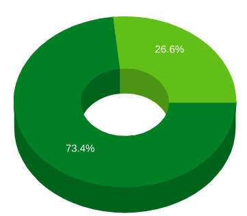 | 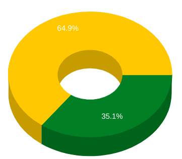 |
|------------|-----------|
| Books Core | Books Web |

### ***Implications for Software Quality, Maintainability, and Performance***

Related Quality Attributes: Complexity, Size

The weighted sum of all class methods an represents the McCabe complexity of a class. It is equal to number of methods, if the complexity is taken as 1 for each method. The number of methods and complexity can be used to predict development, maintaining and testing effort estimation. In inheritance if base class has high number of method, it affects its' child classes and all methods are represented in sub-clasess. If number of methods is high, that class possibly domain spesific. Thefore they are less reusable. Also these classes tend to more change and defect prone.

Weighted Method Count (WMC) is a software metric used to measure the complexity of a class by counting the number of methods it contains, weighted by their complexity. It has implications for software quality, maintainability, and potential performance issues.

#### Software Quality:
- High Weighted Method Count often indicates higher complexity within a class, which can lead to lower software quality. Classes with a large number of methods may have multiple responsibilities or tightly coupled functionality, making them harder to understand, test, and maintain.
- Lowering Weighted Method Count by breaking down classes into smaller, more focused units can improve software quality. Smaller classes with fewer methods are typically easier to understand, test, and maintain, leading to higher code reliability and readability.

#### Maintainability:
- Weighted Method Count directly impacts maintainability. Classes with a high number of methods are more difficult to maintain, as changes to one method may have ripple effects on others within the same class.
- By reducing Weighted Method Count and breaking down complex classes into smaller ones, developers can enhance maintainability. Smaller classes with fewer methods are easier to comprehend and modify, leading to shorter maintenance cycles and lower maintenance costs.

#### Potential Performance Issues:
- While Weighted Method Count itself does not directly impact performance, classes with a high number of methods may introduce performance issues indirectly. Complex classes may contain inefficient algorithms or excessive computations, which can degrade system performance.
- Improving code structure by reducing Weighted Method Count and breaking down complex classes can lead to more efficient code and better overall performance.

#### Implications for Project's Current State:
- **High Weighted Method Count**: Projects with high Weighted Method Count may suffer from decreased software quality and maintainability. Complex classes are harder to understand, modify, and maintain, leading to higher risks of errors and longer maintenance cycles.
- **Moderate Weighted Method Count**: Moderate levels of Weighted Method Count are common in many software projects. However, it's essential to monitor and manage this metric to prevent it from escalating and negatively impacting software quality and maintainability.
- **Low Weighted Method Count**: Projects with low Weighted Method Count typically have well-structured and maintainable codebases with smaller, more focused classes. Lower Weighted Method Count contributes to higher software quality, improved maintainability, and better overall performance.

## 7. Access to Foreign Data (ATFD)

| 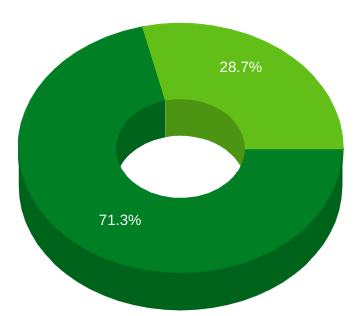 | 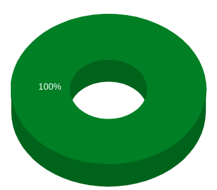 |
|------------|-----------|
| Books Core | Books Web |

### ***Implications for Software Quality, Maintainability, and Performance***

Related Quality Attributes: Coupling

ATFD (Access to Foreign Data) is the number of classes whose attributes are directly or indirectly reachable from the investiggated class. Classes with a high ATFD value rely strongly on data of other classes and that can be the sign of the God Class.

Access to Foreign Data (AFD) is a software metric used to evaluate the extent to which a module accesses data from other modules or external sources. It measures the dependency of a module on foreign data, which can have implications for software quality, maintainability, and potential performance issues.

#### Software Quality:
- High Access to Foreign Data often indicates a lack of encapsulation and can lead to lower software quality. Modules that excessively rely on data from other modules or external sources are tightly coupled and harder to test, understand, and maintain.
- Improving encapsulation and reducing Access to Foreign Data by minimizing dependencies on external data sources can enhance software quality. Well-encapsulated modules are easier to manage and modify, leading to higher code reliability and readability.

#### Maintainability:
- Access to Foreign Data directly impacts maintainability. Modules with high dependency on foreign data are more challenging to maintain, as changes to external data sources may require modifications in multiple modules.
- By reducing Access to Foreign Data and promoting encapsulation, developers can improve maintainability. Modules with fewer dependencies on external data sources are easier to understand, modify, and extend, leading to shorter maintenance cycles and lower maintenance costs.

#### Potential Performance Issues:
- While Access to Foreign Data itself does not directly impact performance, excessive dependency on external data sources may introduce performance issues indirectly. Frequent data retrieval from external sources can result in increased latency and reduced system performance.
- Improving encapsulation and reducing Access to Foreign Data can lead to better performance by minimizing data retrieval from external sources and promoting more efficient data handling within the application.

#### Implications for Project's Current State:
- **High Access to Foreign Data**: Projects with high Access to Foreign Data may suffer from decreased software quality and maintainability. Modules with excessive dependency on external data sources are harder to understand, modify, and maintain, leading to higher risks of errors and longer maintenance cycles.
- **Moderate Access to Foreign Data**: Moderate levels of Access to Foreign Data are common in many software projects. However, it's essential to monitor and manage this metric to prevent it from escalating and negatively impacting software quality and maintainability.
- **Low Access to Foreign Data**: Projects with low Access to Foreign Data typically have well-encapsulated and maintainable modules with minimal dependency on external data sources. Lower Access to Foreign Data contributes to higher software quality, improved maintainability, and better overall performance.

