# Task 3b

## 1. Cyclomatic Complexity

### Books Core

<!-- 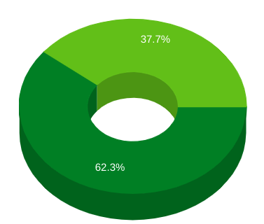 -->

| 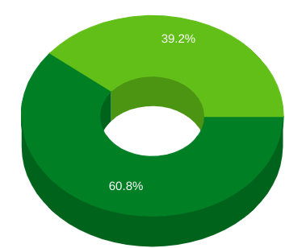 |  |
|------------|-----------|
| Before | After |

The image shows a drop in cyclomatic complexityafter refactoring. This improvement can be attributed to:

- `Removing unused code`: Streamlined the codebase by eliminating unnecessary complexities like the App class.
Addressing feature envy: Improved modularity and reduced code coupling by addressing the "Feature Envy" smell in TagDao.java.
- `Splitting the God class`: Enhanced maintainability by dividing AppContext into focused, single-responsibility classes.
Overall, refactoring successfully increased code readability and maintainability.

### Books Web

<!-- 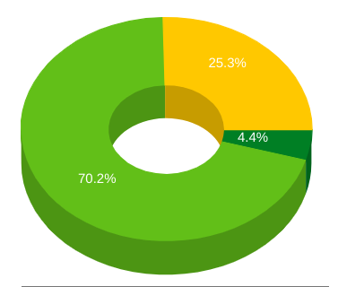 -->

| 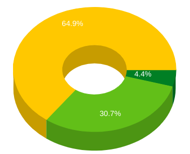 |   |
|------------|-----------|
| Before | After |

The chart shows that the cyclomatic complexity decreased significantly. 

- The code was refactored to be more modular. This means that the code was broken down into smaller, more manageable pieces. This can make the code easier to understand and maintain, and it can also reduce the cyclomatic complexity.

## 2. Coupling

### Books Core

<!-- 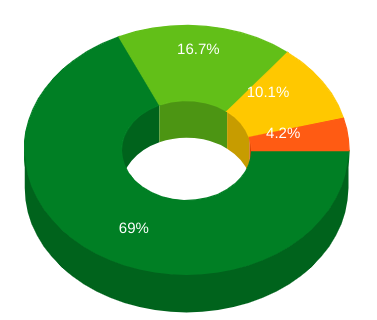 -->

|  |   |
|------------|-----------|
| Before | After |

The image reveals a reduction in coupling 16.7 to 15.5% after refactoring, this indicates a positive shift towards more loosely coupled, modular code. This improvement can be attributed to:

- `Speculative Generality Removal`: Eliminating unused complexities like the App class reduced unnecessary dependencies between code elements.
- `Feature Envy Refactoring`: Addressing "Feature Envy" in TagDao.java likely involved code redistribution, decreasing inter-class coupling.

### Books Web

<!-- 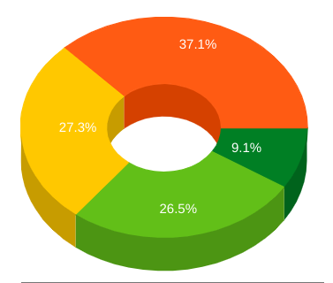 -->

| 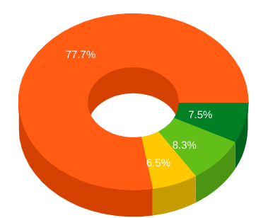 |   |
|------------|-----------|
| Before | After |

it appears that the coupling has decreased from. This is a significant improvement, and it suggests that the new classes are now more independent of each other.

- `Improved Modularity`: Refactoring might have involved decomposing the resource classes into smaller, more focused and self-contained units. This improves modularity, leading to less interaction and tighter boundaries between modules, minimizing coupling.

## 3. Lines of Code per Class (CLOC)

### Books Core

<!-- 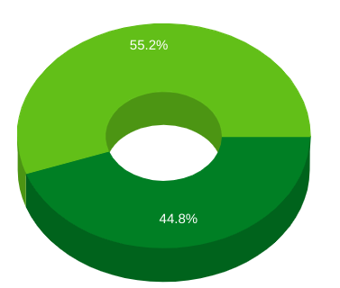 -->

| 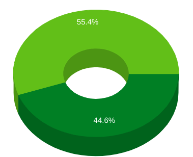 |  |
|------------|-----------|
| Before | After |

The image shows a minor reduction in Lines of Code per Class (55.4% to 55.2%) after refactoring.
Potential Contributors could be:

- `Feature Envy Refactoring`: Addressing feature envy in TagDao.java might have involved distributing its responsibilities to other, potentially smaller classes.
- `Splitting the God Class`: Dividing AppContext into smaller, focused classes likely decreased their CLOC values.
- Though the change is subtle, the CLOC decrease aligns with the refactoring goals of improved modularity and  reduced complexity.

### Books Web

<!-- 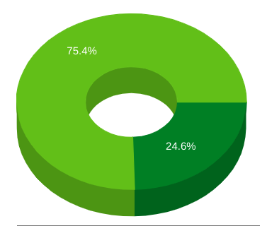 -->

| 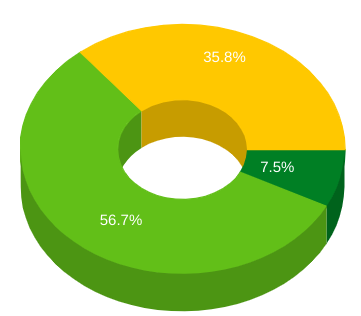 |  |
|------------|-----------|
| Before | After |

the Lines of Code (CLOC) per Class metric decreased from 35.19 to 7.54 after refactoring the UserResource and BooksResource classes. This is a significant reduction of 78.7%. There are several reasons why this might have happened:

- `Extracting smaller methods`: The refactoring may have involved extracting larger methods into smaller, more focused ones. This would reduce the overall size of the classes.

Overall, the reduction in CLOC is a positive sign. It suggests that the refactoring has made the code more concise and easier to understand. This should make it easier to maintain and modify the code in the future.

## 4. Lack of Cohesion(LOC)

### Books Core

<!-- 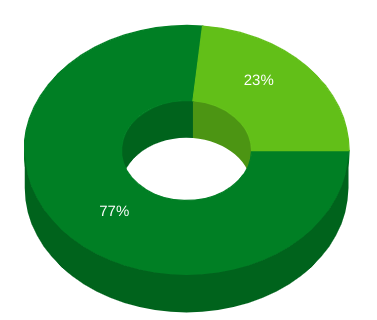 -->

| 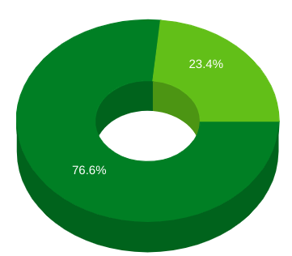 |  |
|------------|-----------|
| Before | After |

The image shows a very minor change in LOC from 23.4% to 23%. The possible reasons for this change are:

- `Addressing Feature Envy`: Refactoring TagDao.java for feature envy likely focused on improving internal class structure and reducing external dependencies, which could have had minimal influence on the broader directory-level LOC metric.

- The change in LOC is very minor probably because the improvements in other areas (like God Class removal) might not directly reflect in LOC values.

### Books Web

<!--  -->

| 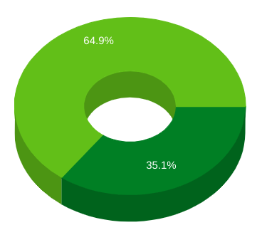 |  |
|------------|-----------|
| Before | After |

The Lack of Cohesion in Methods (LOC) metric for the refactored classes UserResource and BooksResource decreased. There are several reasons why this might have happened:

- `Improved modularity`: The refactoring may have improved the modularity of the code by breaking down the large classes into smaller, more focused classes. This would make it easier to identify and group related methods together, which would improve the LOC metric.

Overall, the improvement in LOC is a positive sign. It suggests that the refactoring has made the code more modular and easier to understand. This should make it easier to maintain and modify the code in the future.

## 5. C3 (ConCeptual Complexity)

### Books Core

<!-- 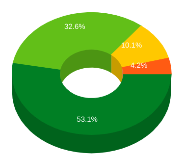 -->

| 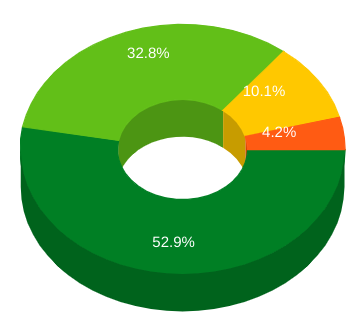 |  |
|------------|-----------|
| Before | After |

The image shows a minimal change in C3 (32.8% to 32.6%), suggesting no significant impact on conceptual complexity after refactoring. Possible explanations are,

- `Limited Scope`: Refactoring efforts might not have directly targeted factors influencing C3, focusing on other aspects like coupling or God Class removal.
- The minor improvement 

### Books Web

<!-- 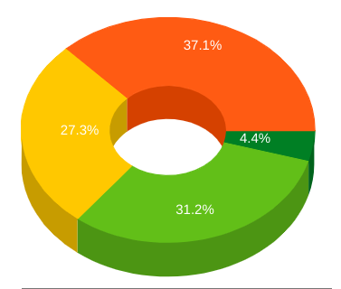 -->

| 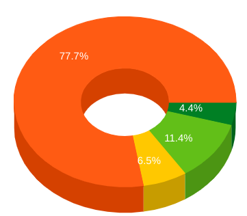 |  |
|------------|-----------|
| Before | After |

The Conceptual Complexity (C3) for the refactored classes UserResource and BooksResource decreased. There are several reasons why this might have happened:

- `Reduced Cyclomatic Complexity`: The refactoring may have reduced the cyclomatic complexity of the code. Cyclomatic complexity is a measure of the number of decision points in a piece of code, such as if statements and loops. By reducing the cyclomatic complexity, the code becomes easier to understand and reason about, which can lead to a lower C3 score.
- `Improved modularity`: The refactoring may have improved the modularity of the code. Modularity is the principle of breaking down a program into smaller, self-contained units. By improving the modularity of the code, the code becomes easier to understand and maintain, which can lead to a lower C3 score.
- `Reduced coupling`: The refactoring may have reduced the coupling between the classes. Coupling is a measure of how dependent one piece of code is on other pieces of code. By reducing the coupling between the classes, the code becomes easier to understand and change, which can lead to a lower C3 score.

Overall, the reduction in C3 is a positive sign. It suggests that the refactoring has made the code more modular, easier to understand, and less error-prone. This should make it easier to maintain and modify the code in the future.

## 6. Weighted Method Count (WMC)

### Books Core

<!--  -->

|  |  |
|------------|-----------|
| Before | After |

The image shows a very minor decrease in WMC in the "books-core" directory, from 26.6% to 26.2%. While not a significant change, it suggests a potential improvement in code complexity.

Possible Contributors:

- `Limited God Class Impact`: Splitting the AppContext class into smaller ones might have had a minimal effect on WMC, depending on the complexity within each new class.
- `Speculative Generality Removal`: Eliminating the App class and related unused code could have had a minor influence on WMC if their method count was low.

### Books Web

<!-- 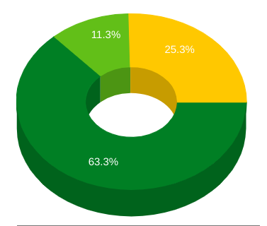 -->

| 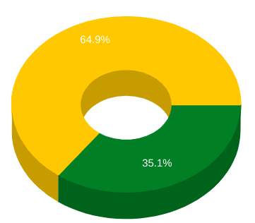 |  |
|------------|-----------|
| Before | After |

the Weighted Method Count (WMC) for the refactored classes UserResource and BooksResource decreased. There are several reasons why this might have happened:

- `Extracting smaller methods`: The refactoring may have involved extracting larger methods into smaller, more focused ones. This would make the code easier to understand and maintain, and it would also reduce the WMC metric.

## 7. Access to Foreign Data (ATFD)

### Books Core

<!-- 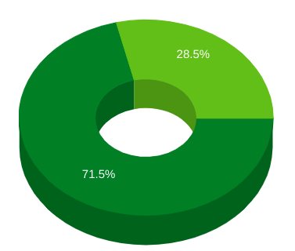 -->

| 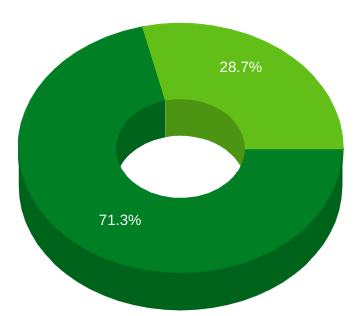 |  |
|------------|-----------|
| Before | After |

The change in the ATFD metric is minimal, with only a 0.2% decrease. This suggests that the refactoring had some positive effect, although very slight, on reducing the access to foreign data within the codebase.

- `Speculative Generality Refactoring`: ** This refactoring is aimed at removing unnecessary complexities, which may not necessarily impact `ATFD` directly unless the complexities included inappropriate data access to other classes.
- `Feature Envy Refactoring`: ** Addressing this smell should ideally reduce `ATFD` because it involves improving encapsulation and reducing the need for a class to access data from another class.
- `God Class Refactoring`: Reducing a God Class into smaller, more focused classes should also have a significant impact on `ATFD`, as it suggests a more distributed and encapsulated design.

### Books Web

<!--  -->

|  |  |
|------------|-----------|
| Before | After |

The ATFD metric remained unchanged after refactoring the UserResource and BooksResource classes. This could be due to a few reasons:

- `No change in data access patterns`: The refactoring may not have changed the way the classes access foreign data. For example, if the classes were already only accessing data through well-defined interfaces or abstractions, then the refactoring would not have introduced any new foreign data dependencies.

- `Encapsulation of foreign data access`: The refactoring may have encapsulated the foreign data access within the classes themselves, rather than relying on external classes or methods. This would hide the implementation details of foreign data access and prevent changes to the classes from affecting the ATFD metric.
